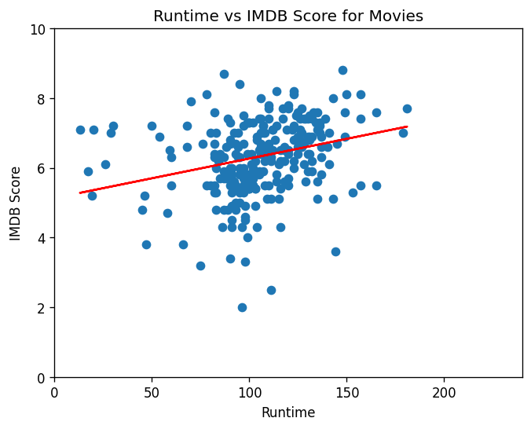

# Movies_ML: Predicting Movie & TV Show Success

Machine learning analysis of Netflix titles to answer:

> **To what extent can a TV show or movie's success be predicted from streaming statistics using machine learning models?**

Success is measured two ways: **critical success** (IMDb score) and **popularity** (number of IMDb votes).

*Group project for COMP20008 Elements of Data Processing, University of Melbourne (Semester 2, 2023), team of 4.*

## Tech Stack
Python · pandas · NumPy · scikit-learn · NLTK (VADER) · BeautifulSoup · httpx · Matplotlib · Seaborn · SciPy

## Models

| Model | Approach | Target |
|---|---|---|
| **Runtime Model** | Linear regression, separate models for movies and TV shows (80/20 split) | IMDb score |
| **Sentiment Analysis Model** | VADER sentiment scores of titles and descriptions → Random Forest regression, holdout vs 10-fold CV, t-test | IMDb score |
| **Cast Analysis Model** | Actor fame scraped from Wikipedia → Decision Tree classifier with GridSearchCV (`max_depth`) and Stratified K-Fold | Binned IMDb score / votes (5 quantile classes) |

## Key Results
- **Runtime:** weak positive linear relationship; longer titles score slightly higher (test MSE ≈ 1.10 for movies, ≈ 0.96 for TV shows).
- **Sentiment:** negative-sentiment titles and descriptions averaged slightly higher IMDb scores, but the t-test showed the difference was not statistically significant.
- **Cast:** famous actors were a better predictor of popularity (accuracy ≈ 0.37) than of critical success (≈ 0.30), but cast alone is not enough to predict success.

<p>
  
  
</p>

## My Contribution
<!-- Edit to match exactly what you built -->
- Built the **runtime regression models** for movies and TV shows (`movieruntimeVsIMDB.py`, `tvruntimeVsIMDB.py`) and evaluated them with MSE
- Wrote the modelling and analysis sections of the report

## Project Structure
```
├── Datasets/                 # titles.csv, credits.csv, scraped + preprocessed data
├── preprocessing.py          # Cleaning, tokenisation, stopword removal, VADER scoring
├── GeneratePage_Size.py      # Wikipedia scraper (actor fame feature)
├── movieruntimeVsIMDB.py     # Runtime model: movies
├── tvruntimeVsIMDB.py        # Runtime model: TV shows
├── Testing/train.py          # Sentiment model: Random Forest, holdout vs K-fold
├── graph.py                  # Sentiment visualisation + t-test
├── SuccessAnalysis.py        # Cast model: IMDb score
├── PopularityAnalysis.py     # Cast model: IMDb votes
├── FeatureAnalysis.py        # Feature importance (exploratory)
├── Analysis.py               # K-means clustering (exploratory)
└── graphs/                   # Output figures
```

## How to Run
```bash
git clone https://github.com/danielkimmelb-cmd/Movies_ML.git
cd Movies_ML
pip install -r requirements.txt
python -c "import nltk; nltk.download('stopwords'); nltk.download('punkt'); nltk.download('vader_lexicon')"

python movieruntimeVsIMDB.py    # e.g. run the runtime model
```
Run all scripts from the repository root. `GeneratePage_Size.py` makes live requests to Wikipedia; its output is already included as `Datasets/credits_with_wiki.csv`.

## Limitations
- VADER is a general-purpose sentiment model, not tuned for film descriptions.
- Mean imputation can bias results if data is not missing completely at random.
- Fame is approximated by whether an actor has a Wikipedia page, so name collisions can mislabel actors.
- Cast models use a single feature; adding genre, release year and text features would likely improve them.

## Team
Techin Techawatcharapanya · Karan Jayakumar · Timothy Wang · Daniel (Dongha) Kim
